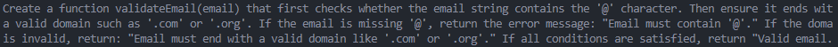
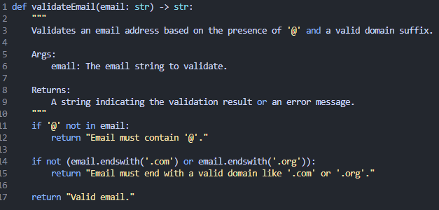

## Part A — Theory (Short Questions)

### 1. Nine Pillars Understanding

**Answer of q1:**  
AI CLI agents handle repetitive coding and setup tasks efficiently, allowing me to focus on designing system architecture rather than spending time on routine work. This helps me understand how modules, workflows, and integrations fit together, growing my capability to plan and manage complex systems.

**Answer of q2:**  
The Nine Pillars remove traditional barriers in coding, testing, deployment, and expertise. By integrating AI agents, specification-driven workflows, reusable skills, and standardized environments, a developer can gain depth in multiple domains—frontend, backend, cloud, testing—simultaneously. This combination enables the M-Shaped profile: strong knowledge in multiple complementary areas instead of being specialized in only one.

### 2. Vibe Coding vs Specification-Driven Development

**Answer of q1:**  
Vibe Coding relies on intuition rather than structured specifications. After a week, code becomes messy, hard to maintain, and prone to bugs because there is no clear plan or system guiding implementation.

**Answer of q2:**  
Specification-Driven Development (SDD) enforces clear, structured requirements in Markdown. AI agents execute these specs, ensuring consistent, reliable code. The system is easier to maintain, extend, and debug because requirements and implementation are synchronized.

---

### 3. Architecture Thinking

**Answer of q1:**  
Architecture-first thinking makes the developer a system designer instead of just a coder. Instead of writing raw code, the developer plans modules, workflows, integrations, and automation, guiding AI agents to implement the system efficiently.

**Answer ofq2:**  
Thinking in layers—Models → IDEs → Agents—ensures modular, scalable, and maintainable software. It allows developers to leverage AI agents effectively, reuse components, and build complex systems without rewriting everything from scratch.

---

## Part B — Practical Task Solution

**Gave this prompt:**

**Result:**

---

## Part C — Multiple Choice Questions

1. **What is the main purpose of Spec-Driven Development?**
   **B. Clear requirements before coding begins**

2. **What is the biggest mindset shift in AI-Driven Development?**
   **B. Thinking in systems and clear instructions**

3. **Biggest failure of Vibe Coding?**
   **B. Architecture becomes hard to extend**

4. **Main advantage of using AI CLI agents (like Gemini CLI)?**
   **B. Handle repetitive tasks so dev focuses on design & problem-solving**

5. **What defines an M-Shaped Developer?**
   **C. Deep skills in multiple related domains**
