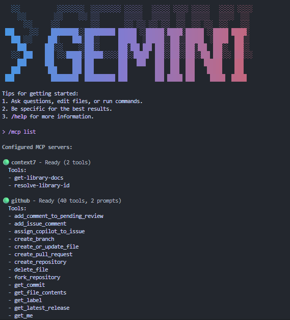
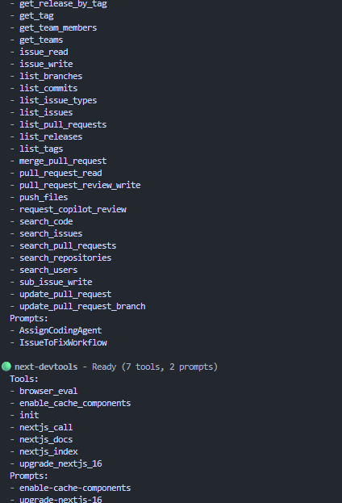
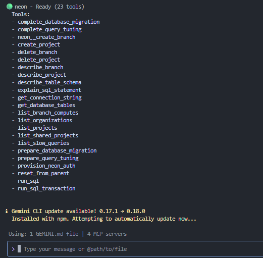
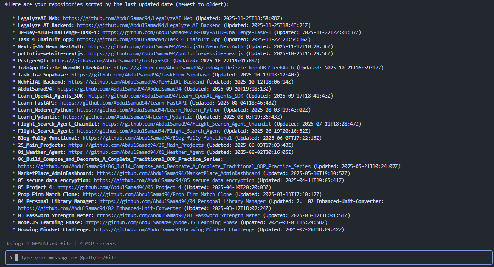

# Task 6 - GitHub × MCP Integration (Hosted Method)

I already have **4 MCP servers connected**, including GitHub. This means my system is already configured and working.

### Settings.json:

```
{
  "ide": {
    "hasSeenNudge": true
  },
  "security": {
    "auth": {
      "selectedType": "oauth-personal"
    }
  },
  "mcpServers": {
    "context7": {
      "command": "npx",
      "args": ["-y", "@upstash/context7-mcp"],
      "env": {
        "CONTEXT7_API_KEY": "API_KEY"
      }
    },
    "github": {
      "httpUrl": "https://api.githubcopilot.com/mcp/",
      "headers": {
        "Authorization": "Bearer TOKEN_KEY"
      }
    },
    "next-devtools": {
      "command": "npx",
      "args": ["-y", "next-devtools-mcp@latest"]
    },
    "neon": {
      "command": "cmd",
      "args": [
        "/c",
        "npx",
        "-y",
        "@neondatabase/mcp-server-neon",
        "start",
        "API_KEY"
      ]
    }
  }
}

```

Below is the Screenshot

## 1. List of MCP Servers

<br>
<br>


## 2. GitHub Repo List Output



I have also created a Notion documentation for adding multiple MCP servers:

[📘 Complete Guide: Adding Multiple MCP Servers to Gemini CLI](https://www.notion.so/Complete-Guide-Adding-MCP-Servers-to-Gemini-CLI-2b5bee3e4d798004b21be02cdc01d7b9)
