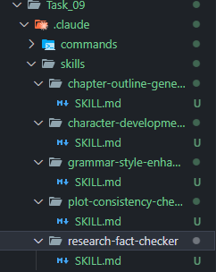

# Task 9: Claude Code Skills for Book Generation

## Student Information

- **Name**: Abdul Samad Siddiqui
- **Date**: December 10, 2024
- **Task**: Task 9 — Custom Claude Code Skills
- **Instructor**: Sir Hamzah Syed

---

## Overview

This submission includes **5 custom Claude Code Skills** designed specifically for book generation workflows. These skills automate and enhance various aspects of the book writing process, from initial planning to final polishing.

---

## Custom Skills Created

### 1. Chapter Outline Generator

**File**: `.claude/skills/chapter-outline-generator/SKILL.md`

**Purpose**: Generates comprehensive chapter outlines including:

- Chapter titles and summaries
- Learning objectives
- Main sections and subsections
- Estimated word counts
- Logical flow validation

**Use Case**: When authors need help structuring a book, creating a table of contents, or organizing chapter content.

**Key Features**:

- Works for both fiction (novels, stories) and non-fiction (business books, textbooks)
- Ensures balanced chapter lengths
- Provides detailed hierarchical structure
- Includes examples for mystery fiction and business books

---

### 2. Character Development Assistant

**File**: `.claude/skills/character-development-assistant/SKILL.md`

**Purpose**: Creates detailed character profiles including:

- Physical appearance and mannerisms
- Personality traits (strengths, flaws, quirks)
- Backstory and formative events
- Motivations, fears, and desires
- Relationships with other characters
- Character arc mapping (beginning → transformation → ending)

**Use Case**: When authors need to develop compelling, multi-dimensional characters for their stories.

**Key Features**:

- Comprehensive character framework using MBTI and Big Five personality indicators
- Relationship mapping between characters
- Character arc development (positive, negative, or flat arcs)
- Extensive examples including fantasy protagonist and contemporary supporting character
- Helps avoid flat, one-dimensional characters

---

### 3. Plot Consistency Checker

**File**: `.claude/skills/plot-consistency-checker/SKILL.md`

**Purpose**: Analyzes narrative for:

- Timeline inconsistencies and impossible timeframes
- Character knowledge violations and continuity errors
- Plot holes and unresolved threads
- World-building contradictions
- POV (Point of View) violations
- Pacing issues

**Use Case**: When authors need to ensure their story remains logically consistent and identify plot holes.

**Key Features**:

- Multi-dimensional tracking (timeline, character actions, plot threads, world rules)
- Generates comprehensive consistency reports with severity ratings
- Visualizes timelines to spot issues
- Tracks unresolved plot threads
- Detailed examples for fantasy timeline issues and romance POV violations
- Priority-based fix recommendations

---

### 4. Research and Fact-Checking Tool

**File**: `.claude/skills/research-fact-checker/SKILL.md`

**Purpose**: Assists with:

- Research strategy development
- Fact verification (historical, scientific, cultural, professional)
- Identifying anachronisms and inaccuracies
- Integrating research into narrative without info-dumping
- Source bibliography management

**Use Case**: For historical fiction, non-fiction, science fiction requiring real-world accuracy, or any genre needing factual verification.

**Key Features**:

- Structured research frameworks for different topic types
- Fact-checking reports with source verification
- Detects anachronisms (items/phrases that didn't exist in time period)
- Techniques for weaving research naturally into prose
- Examples: 1920s Paris research and sci-fi Mars colony fact-check
- Bibliography generation

---

### 5. Grammar and Style Enhancer

**File**: `.claude/skills/grammar-style-enhancer/SKILL.md`

**Purpose**: Provides:

- Grammar and mechanics error detection
- Style improvement suggestions (passive→active voice, weak verbs→strong verbs)
- Clarity and concision recommendations
- Consistency checking (tense, POV, spelling variants)
- Readability metrics and analysis

**Use Case**: When authors need to polish their prose while preserving their unique voice.

**Key Features**:

- Multi-level analysis (grammar, clarity, style, consistency, readability)
- Before/after comparison examples
- Preserves author's voice while fixing technical issues
- Genre-specific style recommendations
- Word choice enhancement suggestions
- Detailed examples for fiction prose and academic writing
- Explains WHY changes improve the text, not just WHAT to change

---

## Directory Structure

```
Task_09/
└── .claude/
    └── skills/
        ├── chapter-outline-generator/
        │   └── SKILL.md
        ├── character-development-assistant/
        │   └── SKILL.md
        ├── plot-consistency-checker/
        │   └── SKILL.md
        ├── research-fact-checker/
        │   └── SKILL.md
        └── grammar-style-enhancer/
            └── SKILL.md
```

---

## Skill Format

Each skill follows the official Claude Code Skills format:

### YAML Frontmatter

```yaml
---
name: skill-name-here
description: Brief description of what the skill does and when to use it (max 1024 characters)
---
```

### Content Structure

1. **Purpose**: Clear explanation of what the skill does
2. **When to Use**: Specific triggers for Claude to invoke the skill
3. **Instructions**: Step-by-step process Claude follows
4. **Examples**: Concrete demonstrations showing the skill in action
5. **Tips**: Best practices for authors
6. **Validation Checklist**: Quality assurance steps

---

## Why These Skills Add Value

### 1. Reusability

All skills are designed to be usable across multiple book projects, not just one-time use.

### 2. Automation

Automate repetitive tasks like:

- Generating outlines
- Creating character profiles
- Checking consistency
- Researching facts
- Polishing prose

### 3. Quality Enhancement

Each skill improves book quality by:

- Ensuring logical consistency
- Developing multi-dimensional characters
- Maintaining factual accuracy
- Enhancing readability
- Providing structured frameworks

### 4. Comprehensive Coverage

Together, the 5 skills cover the entire book writing workflow:

- **Planning Stage**: Chapter Outline Generator
- **Development Stage**: Character Development Assistant
- **Writing Stage**: Research and Fact-Checking Tool
- **Revision Stage**: Plot Consistency Checker, Grammar and Style Enhancer

---

## Testing Notes

Each skill has been designed with:

- **Clear trigger conditions**: Claude knows when to use each skill
- **Structured output formats**: Consistent, readable results
- **Multiple examples**: Demonstrating different use cases
- **Validation checklists**: Ensuring quality output

---

## Hackathon Preparation

These skills prepare me for the upcoming Hackathon by:

1. **Understanding agentic workflows**: Skills represent modular, reusable agent capabilities
2. **Structured problem-solving**: Each skill breaks down complex tasks into steps
3. **Domain expertise**: Deep understanding of book writing process
4. **Output quality**: Focus on delivering actionable, valuable results
5. **User experience**: Clear instructions and examples for skill activation

---

## Conclusion

This submission demonstrates the creation of 5 comprehensive, production-ready Claude Code Skills that significantly enhance the book writing process. Each skill is thoroughly documented with examples, follows best practices, and provides real value to authors working on fiction, non-fiction, or academic books.

The skills work together as a cohesive system covering the entire book creation lifecycle from initial planning through final polishing, making them highly valuable for any AI-assisted book generation workflow.

---

## Screenshots

### VSCode Explorer - `.claude` Directory Structure



The screenshot above shows the complete `.claude` directory structure with all 5 custom skills properly organized in their respective folders.

---

**Submitted by**: Abdul Samad Siddiqui  
**Date**: December 10, 2024  
**Channel**: 30-Day Challenge Channel
