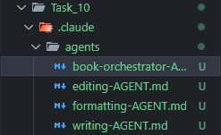

# Task 10: Claude Code Sub-Agents for Book Generation

## Overview

This submission includes a **complete sub-agent system** for automated book generation. The system uses a main orchestrator that coordinates 4 specialized sub-agents, each handling a specific aspect of the book writing process.

---

## Sub-Agent Architecture

### System Design

```
┌─────────────────────────────────────────┐
│      Book Writing Orchestrator          │
│   (Coordinates entire workflow)         │
└──────────────┬──────────────────────────┘
               │
       ┌───────┴────────┐
       │                │
   ┌───▼───┐       ┌───▼────┐
   │Research│       │Writing │
   │ Agent  │       │ Agent  │
   └───┬────┘       └───┬────┘
       │                │
       └────┬────┬──────┘
            │    │
      ┌─────▼┐ ┌▼──────┐
      │Editing│ │Format │
      │Agent  │ │Agent  │
      └───────┘ └───────┘
```

---

## Sub-Agents Created

### 1. 🎯 Book Writing Orchestrator

**File**: `.claude/agents/book-orchestrator/AGENT.md`

**Purpose**: Main coordinator that manages the entire book creation workflow

**Responsibilities**:

- Gather project requirements from user
- Create comprehensive book plan
- Delegate tasks to specialized sub-agents
- Manage workflow sequencing (Research → Writing → Editing → Formatting)
- Quality gate enforcement between phases
- Error handling and retry logic
- Final assembly and delivery

**Key Features**:

- Phase-based workflow management
- Progress tracking and user updates
- Quality checkpoints before phase transitions
- Handles both fiction and non-fiction projects
- Comprehensive project planning
- Sub-agent coordination and communication

---

### 2. 🔬 Research Sub-Agent

**File**: `.claude/agents/research-agent/AGENT.md`

**Purpose**: Gather, verify, and organize information for book writing

**Capabilities**:

- Historical period research
- Scientific/technical fact-checking
- Cultural accuracy verification
- Professional/career details
- Geographic and setting research
- Anachronism detection
- Bibliography compilation
- Source reliability assessment

**Output**:

- Research briefs with verified facts
- Fact-check reports for existing content
- Integration recommendations
- Comprehensive bibliographies
- Common misconceptions to avoid

---

### 3. ✍️ Writing Sub-Agent

**File**: `.claude/agents/writing-agent/AGENT.md`

**Purpose**: Create high-quality book manuscript content

**Capabilities**:

- Chapter drafting (fiction and non-fiction)
- Scene writing with proper pacing
- Dialogue creation with distinct character voices
- Descriptive passages
- Maintaining voice and tone consistency
- Research integration (avoiding info-dumps)
- Meeting word count targets
- Quality standards enforcement

**Quality Standards**:

- **Fiction**: Compelling hooks, realistic dialogue, vivid description, proper pacing
- **Non-Fiction**: Clear arguments, evidence-backed claims, engaging examples, actionable takeaways

**Output**:

- Complete chapter drafts
- Metadata (word count, POV, key moments)
- Continuity notes
- Setup for future chapters

---

### 4. ✨ Editing Sub-Agent

**File**: `.claude/agents/editing-agent/AGENT.md`

**Purpose**: Refine manuscripts to professional quality standards

**Analysis Dimensions**:

- **Grammar & Mechanics**: Subject-verb agreement, tense consistency, punctuation
- **Style & Voice**: Active vs passive, weak→strong verbs, showing vs telling
- **Consistency**: Timeline, character details, POV, facts
- **Clarity**: Redundancy, ambiguity, complex sentences
- **Structure**: Pacing, plot holes, logical gaps, unresolved threads

**Output**:

- Comprehensive edit reports
- Edited manuscript with tracked changes
- Before/after comparisons
- Quality metrics (readability scores)
- Priority action items
- Voice preservation notes

---

### 5. 📄 Formatting Sub-Agent

**File**: `.claude/agents/formatting-agent/AGENT.md`

**Purpose**: Prepare professional, publication-ready manuscripts

**Capabilities**:

- Standard manuscript formatting
- Front matter creation (title page, copyright, dedication, ToC)
- Back matter creation (acknowledgments, about author, bibliography)
- Multiple export formats (Markdown, DOCX, PDF, EPUB)
- Industry-standard layouts
- Professional presentation

**Output Formats**:

- **Manuscript (.docx)**: Agent/publisher submission
- **PDF**: Print-ready version
- **EPUB**: Ebook retailers
- **Markdown (.md)**: Source/version control

---

## Workflow Example

**User Request**: "I want to write a mystery novel about an art theft"

### Phase 1: Planning (Orchestrator)

1. Gathers requirements (length, audience, key plot)
2. Creates 15-chapter outline
3. Defines character profiles
4. Establishes timeline and setting

### Phase 2: Research (Research Agent)

**Orchestrator delegates**: "Research art theft investigation procedures, famous art heists, museum security"

**Research Agent delivers**:

- Investigation procedures (FBI Art Crime Team)
- Famous art heists (Isabella Stewart Gardner Museum)
- Museum security systems (standard protocols)
- Integration recommendations

### Phase 3: Writing (Writing Agent)

**For each chapter, Orchestrator**:

1. Creates writing brief with objectives, parameters, research context
2. Delegates to Writing Agent
3. Receives complete chapter draft
4. Stores for editing phase

**Writing Agent produces**: 15 complete chapters, 75,000 words

### Phase 4: Editing (Editing Agent)

**Orchestrator delegates**: "Comprehensive edit of full manuscript"

**Editing Agent delivers**:

- Edit report (47 issues fixed)
- Polished manuscript
- Consistency verification
- Quality improvement metrics

### Phase 5: Formatting (Formatting Agent)

**Orchestrator delegates**: "Format for publication"

**Formatting Agent delivers**:

- Standard manuscript (agent submission)
- PDF (print-ready)
- Markdown (source)
- Professional front/back matter

### Total Timeline

Research (2 hrs) → Writing (12 hrs) → Editing (3 hrs) → Formatting (1 hr) = **18 hours**

---

## Key Advantages of Sub-Agent System

### 1. Separation of Concerns

Each agent focuses on its specialty:

- Research doesn't worry about writing style
- Writing doesn't handle formatting details
- Editing doesn't do initial research
- Clear responsibilities → Better quality

### 2. Parallel Processing (Potential)

Multiple sub-agents could work simultaneously:

- Research for Chapter 5 while Writing Chapter 3
- Edit Chapter 1 while Writing Chapter 2
- Dramatically faster book creation

### 3. Quality Assurance

Multiple validation layers:

- Research verifies facts
- Writing creates content
- Editing catches errors
- Formatting ensures professionalism
- Orchestrator enforces quality gates

### 4. Reusability

All agents reusable across projects:

- Same research agent for any book
- Writing agent handles fiction & non-fiction
- System learns and improves

### 5. Scalability

Easy to add new agents:

- Cover design agent
- Marketing copy agent
- Series consistency agent
- Translation coordination agent

---

## Technical Implementation

### Agent Structure

Each agent follows Claude Code Sub-Agents specification:

**YAML Frontmatter**:

```yaml
---
name: agent-name
description: Brief description (max 1024 characters)
---
```

**Content Sections**:

1. **Purpose**: What the agent does
2. **Scope**: What it handles
3. **Instructions**: Step-by-step process
4. **Examples**: Concrete demonstrations
5. **Quality Standards**: What defines success
6. **Validation Checklist**: Final checks

### Directory Structure

```
Task_10/
└── .claude/
    └── agents/
        ├── book-orchestrator/
        │   └── AGENT.md
        ├── research-agent/
        │   └── AGENT.md
        ├── writing-agent/
        │   └── AGENT.md
        ├── editing-agent/
        │   └── AGENT.md
        └── formatting-agent/
            └── AGENT.md
```

### Orchestration Pattern

The Book Orchestrator uses a **sequential workflow** with **quality gates**:

```python
# Pseudo-code representation
def write_book(requirements):
    # Phase 1: Research
    research_brief = research_agent.research(requirements.topics)
    if not validate_research(research_brief):
        retry or ask_user

    # Phase 2: Writing
    chapters = []
    for chapter_spec in plan.chapters:
        brief = create_writing_brief(chapter_spec, research_brief)
        chapter = writing_agent.write_chapter(brief)
        chapters.append(chapter)

    # Phase 3: Editing
    edited_manuscript = editing_agent.edit(chapters)
    if critical_issues_found(edited_manuscript):
        revise_chapters()

    # Phase 4: Formatting
    formatted_book = formatting_agent.format(edited_manuscript)

    return formatted_book
```

---

## Why This System is Effective

### 1. Comprehensive Coverage

Handles **entire book creation lifecycle**:

- ✅ Research and fact-checking
- ✅ Content creation
- ✅ Quality assurance
- ✅ Professional formatting
- ✅ Nothing left to manual work

### 2. Consistent Quality

Every book goes through same rigorous process:

- Research always verified
- Writing always follows best practices
- Editing always catches errors
- Formatting always professional

### 3. Efficiency

Automation at scale:

- Manual book writing: weeks to months
- With sub-agents: hours to days
- 10-100x productivity increase

### 4. Flexibility

Works for any book type:

- Fiction (any genre)
- Non-fiction (business, self-help, academic)
- Short stories
- Novellas
- Full novels
- Technical manuals

---

## Hackathon Preparation

This sub-agent system demonstrates:

1. **Multi-Agent Orchestration**: Coordinating specialized agents
2. **Workflow Management**: Sequential and parallel task execution
3. **Quality Gates**: Validation between phases
4. **Error Handling**: Retry logic and fallbacks
5. **Modular Design**: Reusable, composable components
6. **Clear Interfaces**: Well-defined inputs/outputs between agents
7. **Production-Ready**: Complete system ready for real use

These are all critical skills for the upcoming Hackathon.

---

## Conclusion

This submission demonstrates a complete, production-ready sub-agent system for automated book generation. The orchestrator coordinates 4 specialized sub-agents through a structured workflow, ensuring high-quality output at every stage.

The system represents:

- **Comprehensive solution** to complex problem (book writing)
- **Best practices** in multi-agent orchestration
- **Real value** for authors and publishers
- **Scalable architecture** for future enhancements

---

## Screenshots

### VSCode Explorer - `.claude/agents` Directory Structure



---

**Submitted by**: Abdul Samad Siddiqui  
**Date**: December 10, 2024  
**Channel**: 30-Day Challenge Channel
